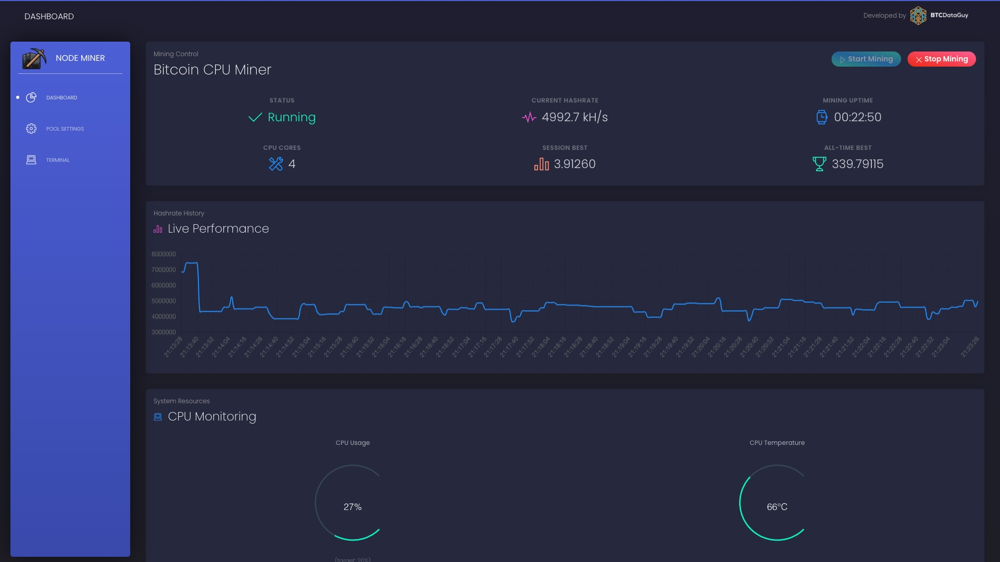
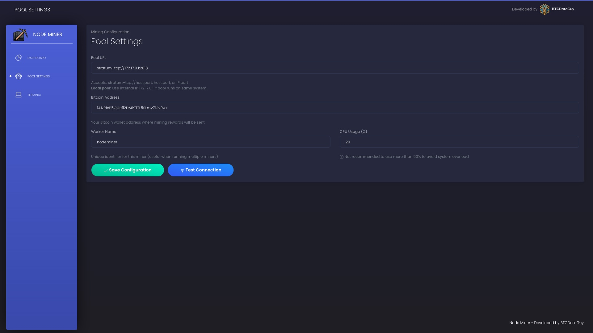

# Node Miner

Bitcoin CPU mining on your Umbrel node - for education and fun.

## Overview

Node Miner enables Bitcoin CPU mining directly on your Umbrel node using cpuminer-multi. Perfect for node operators who don't have dedicated mining hardware yet (like a Bitaxe or similar) and want to experiment with mining.

**Important:** This is for education and fun, not profit. CPU mining Bitcoin is unprofitable - you'll spend more on electricity than you'll earn. Use this to:
- Learn how Bitcoin mining works
- Experiment with mining pools
- Have fun with your node

## Screenshots

*Mining dashboard with real-time statistics and controls*

*Pool configuration interface*

## Features

- **Flexible Pool Configuration**: Connect to external mining pools or internal pools running on the same system
  - For internal pools (e.g., on the same Umbrel), use the internal IP: `172.17.0.1`
- **Adjustable CPU Usage**: Set mining intensity from 1-100% of your CPU power
- **Real-time Dashboard**: Monitor hashrate, mining statistics, and system resources
- **Simple Controls**: Easy start/stop buttons with live status updates

## Installation

1. Install Node Miner from the Umbrel Community App Store
2. Open the app from your Umbrel dashboard
3. Configure your pool settings
4. Start mining!

## Recommended Setup for Beginners

If you're new to mining pools, we recommend starting with **Public Pool**:
- Lower starting difficulty (0.1) means you'll see results within minutes
- Great for testing and learning how mining works
- Available in the Umbrel App Store

**Note:** Other pools like Bassin use higher starting difficulties (42+), which can take days to show your first share. Both work perfectly - it's just about feedback speed.

## Important Warning

⚠️ **System Overload Risk** - Mining with high CPU percentages (>50%) can overload your system and make it unresponsive. Start low (10-20%) and monitor your system carefully.

## Configuration

### Pool URL
Enter your mining pool URL. Formats accepted:
- `stratum+tcp://pool.example.com:3333`
- `pool.example.com:3333`
- `172.17.0.1:2018` (for internal pools)

**Important**: If you're running a mining pool on the same Umbrel system, use the internal IP address `172.17.0.1` instead of localhost or 127.0.0.1.

### CPU Usage
Choose carefully! Recommended:
- **10-20%**: Safe for most systems
- **30-40%**: Monitor system responsiveness
- **50%+**: ⚠️ High risk of system overload - not recommended

## Credits

Big thanks to the open-source projects that made this possible:

**cpuminer-multi** by tpruvot - The powerful mining engine that does all the heavy lifting  
https://github.com/tpruvot/cpuminer-multi (GPL-2.0)

**Black Dashboard** by Creative Tim - Beautiful UI theme that makes everything look great  
https://www.creative-tim.com/product/black-dashboard (MIT License)

## License

MIT License (see LICENSE file). Includes cpuminer-multi (GPL-2.0) and Black Dashboard (MIT).

## Support

For issues or questions:
- GitHub Issues: https://github.com/BTCDataGuy/node-miner/issues
- X (Twitter): https://x.com/BTCDataGuy
